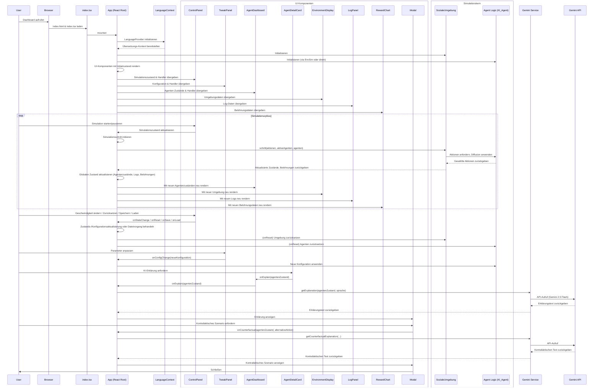

# Run and deploy your AI Studio app

This contains everything you need to run your app locally.

## Run Locally

**Prerequisites:**  Node.js

1. Install dependencies:
   `npm install`
2. Set the `GEMINI_API_KEY` in [.env.local](.env.local) to your Gemini API key
3. Run the app:
   `npm run dev`
# Ein Blick hinter die Kulissen: Wie ich KI-Agenten ihre Seele entlocke

Von: Ralf Krümmel

---

Hallo, liebe Leserinnen und Leser! Ralf Krümmel hier, und heute möchte ich Ihnen ein Projekt vorstellen, das mir besonders am Herzen liegt: Unser Dashboard für Reinforcement-Learning-Agenten. Wenn Sie sich jemals gefragt haben, was in den „Köpfen“ von KI-Agenten vor sich geht, während sie lernen und Entscheidungen treffen, dann sind Sie hier genau richtig!Dieses Dashboard ist weit mehr als nur eine hübsche Oberfläche. Es ist ein interaktives Labor, das uns ermöglicht, das komplexe Zusammenspiel von Q-Learning-Algorithmen, psychologischen Antrieben und sogar Emotionen in Echtzeit zu beobachten. Mein Ziel war es, die oft undurchsichtige „Black Box“ der KI aufzubrechen und Ihnen einen direkten Blick hinter die Kulissen zu ermöglichen. Begleiten Sie mich auf eine kleine Tour!

## Ihr interaktives KI-Labor: Das Dashboard im Detail

Das Dashboard ist sorgfältig in verschiedene Bereiche unterteilt, die Ihnen einen umfassenden Überblick und Kontrolle über die Simulation geben.

### Die Kommandozentrale: Steuerung der Simulation

Direkt oben im Hauptbereich finden Sie die grundlegenden Schalter für Ihre Experimente:

*   **Start / Pause:** Beginnen oder unterbrechen Sie die Simulation, um das Geschehen in Ruhe zu analysieren.
*   **Zurücksetzen:** Bringt alles auf Anfang – perfekt für neue Experimente oder wenn Sie sich in einer Sackgasse befinden.
*   **Speichern / Laden:** Sie können den aktuellen Zustand Ihrer gesamten Simulation (Agenten, Umgebung, Logs, Konfiguration) speichern und später wieder laden. So geht kein Fortschritt verloren!
*   **Tempo:** Stellen Sie die Geschwindigkeit der Simulation ein, von „Langsam“ für detaillierte Beobachtungen bis „Turboschnell“ für schnelle Lernzyklen.
*   **Episode / Schritt:** Behalten Sie immer den Überblick über den aktuellen Fortschritt der Simulation.

### Die Welt unserer Agenten: Die Simulationsumgebung

Das große quadratische Feld in der Mitte visualisiert die Umgebung, in der unsere Agenten leben und lernen. Sie sehen hier:

*   **Agenten:** Jeder Agent ist ein farbiger Kreis mit einer ID (0-4). Die Farbe stimmt mit der Farbe seines aktuellen Ziels überein.
*   **Ziele:** Die Kreuze zeigen an, wohin jeder Agent gerade unterwegs ist. Sie werden sehen, wie sie versuchen, diese Ziele zu erreichen.
*   **Dynamische Hindernisse:** Wenn aktiviert, erscheinen rote „X“-Symbole, denen die Agenten ausweichen müssen. Kollisionen werden bestraft!
*   **Agentenaktivität:** Deaktivierte Agenten erscheinen ausgegraut und nehmen nicht aktiv am Geschehen teil – nützlich, um einzelne Agenten zu isolieren.

### Live-Konfiguration: Das Gehirn der Agenten tunen

Dieses Panel ist Ihr Spielplatz für die Feinabstimmung der KI! Hier können Sie die wichtigsten Parameter der Reinforcement-Learning-Agenten und der Umgebung in Echtzeit anpassen:

*   **Lernrate (α):** Wie schnell die Agenten auf neue Informationen reagieren.
*   **Diskontierungsfaktor (γ):** Wie wichtig zukünftige Belohnungen sind – ein höherer Wert fördert langfristiges Denken.
*   **Exploration (ε):** Die Wahrscheinlichkeit, dass ein Agent zufällig experimentiert, anstatt das Bestehende auszunutzen.
*   **Frustrationsschwelle:** Ab wann Frustration das Agentenverhalten beeinflusst.
*   **Impulsive Explorationsverstärkung:** Ein zusätzlicher Drang zur Erkundung, wenn der Agent frustriert ist.
*   **Meta-kognitive Verstärkung:** Ein Explorations-Boost, wenn der Agent „verwirrt“ ist, also über längere Zeit schlechte Leistungen zeigt. Er sucht dann aktiv nach neuen Strategien!
*   **Hindernisse aktivieren / Anzahl Hindernisse:** Schalten Sie dynamische Hindernisse ein und passen Sie deren Menge an.

### Ein Blick in die Seele: Die Agenten-Details

Jeder Agent hat seine eigene Detailkarte – hier wird es wirklich spannend! Sie erhalten tiefe Einblicke in den internen Zustand jedes Agenten:

*   **Agenten-ID & Belohnung:** Wer ist es, und was hat er zuletzt verdient?
*   **Aktivieren/Deaktivieren Schalter:** Steuern Sie die Teilnahme einzelner Agenten an der Simulation.
*   **Emotionen:** Drei Messgeräte zeigen die aktuellen emotionalen Zustände an:
    *   **Valenz (Freude):** Von unangenehm (-1) bis angenehm (1).
    *   **Aktivierung (Aufregung):** Von ruhig (0) bis aufgeregt (1).
    *   **Dominanz (Kontrolle):** Von unterwürfig (-1) bis dominant (1).
*   **Antriebe:** Balken zeigen die Intensität innerer Antriebe wie **Neugier**, **Verständnis** und **Frustration** an. Diese beeinflussen maßgeblich das Verhalten!
*   **Ziel:** Was der Agent gerade erreichen möchte, z.B. „Erkunden“ oder „Frustration reduzieren“.
*   **Q-Learning-Zustand:** Hier sehen Sie den aktuellen diskretisierten Zustand und die Q-Werte für jede mögliche Aktion – eine Art „Erfolgs-Score“ für jede Wahl. Die zuletzt gewählte Aktion ist hervorgehoben.
*   **Ereignisverlauf:** Eine chronologische Liste wichtiger Ereignisse, die der Agent erlebt hat (Zielwechsel, neue Zustände, Frustrationsspitzen).
*   **Verwirrter Zustand:** Ein Fragezeichen-Symbol zeigt an, wenn ein Agent „verwirrt“ ist und seine Explorationsrate erhöht, um aus einer Leistungstief zu finden.

### KI-Erklärungen: Wenn Gemini die Agenten entschlüsselt

Das ist meine absolute Lieblingsfunktion! Auf jeder Agenten-Detailkarte finden Sie den Knopf „Mit KI erklären“. Dahinter steckt die Google Gemini KI, die die Entscheidungen unserer Agenten in natürlicher Sprache erklärt.

*   **Warum diese Aktion?** Die KI analysiert Q-Werte, Emotionen, Antriebe und Ziele, um zu begründen, warum der Agent genau diese Aktion gewählt hat. Sie werden staunen, wie verständlich komplexe KI-Entscheidungen plötzlich werden.
*   **Kontrafaktische Analyse:** Nach der Erklärung können Sie fragen: „Was wäre, wenn stattdessen Aktion X gewählt worden wäre?“ Gemini prognostiziert dann die wahrscheinlichen Auswirkungen auf Belohnung und Frustration. Ein unschätzbares Werkzeug, um die Entscheidungsfindung wirklich zu durchdringen!

**Wichtiger Hinweis:** Für diese Funktion benötigen Sie einen konfigurierten Gemini API-Schlüssel. Ohne ihn bleibt der Knopf deaktiviert.

### Das Gedächtnis der Simulation: Logs und Leistung

*   **Leistungsübersicht (Belohnungsdiagramm):** Ein Diagramm zeigt die durchschnittliche Belohnung der aktiven Agenten pro Schritt. Eine steigende Linie ist ein gutes Zeichen!
*   **Globale Logs:** Hier werden alle wichtigen Ereignisse chronologisch protokolliert, aufgeteilt nach Quelle (SYSTEM, AGENT, UMGEBUNG, REGELWERK, GEMINI). Sie können die Logs auch als JSON-Datei exportieren.

## Tiefenbohrung: Was unter der Oberfläche steckt

Ich möchte Ihnen auch einen kleinen Einblick geben, wie dieses System aufgebaut ist. Es ist eine faszinierende Mischung aus moderner Webentwicklung und KI-Konzepten.

### Die Architektur: Ein Flussdiagramm der Intelligenz

Das folgende Sequenzdiagramm zeigt den Fluss der Interaktionen und Daten innerhalb der Anwendung. Es ist das Herzstück, das alles zusammenhält:

### Die Bausteine der Agentenintelligenz

Im Kern des Systems arbeiten unsere Agenten mit dem **Q-Learning-Algorithmus**, der es ihnen ermöglicht, durch Versuch und Irrtum zu lernen, welche Aktionen in welchen Zuständen die besten Belohnungen versprechen. Aber wir gehen noch einen Schritt weiter:

*   **Emotionales Modell:** Die Agenten besitzen ein eigenes Emotionsmodell, das Valenz (Freude), Aktivierung (Aufregung) und Dominanz (Kontrolle) simuliert. Diese Emotionen werden durch Belohnungen und die Vorhersagbarkeit der Umgebung beeinflusst.
*   **Antriebe:** Neben Emotionen haben die Agenten auch intrinsische Antriebe wie **Neugier**, **Verständnis** und **Frustration**. Diese treiben ihr Verhalten über die reine Belohnungsmaximierung hinaus an – ein frustrierter Agent könnte beispielsweise impulsiver handeln, um seine Situation zu verbessern.
*   **Emotionale Diffusion:** Ein spannendes Feature ist die emotionale Diffusion: Die Frustration kann sich zwischen benachbarten Agenten ausbreiten, was zu komplexen sozialen Dynamiken führt.
*   **Meta-Kognition:** Wenn ein Agent über einen längeren Zeitraum schlechte Belohnungen erhält, gerät er in einen „verwirrten“ Zustand und erhöht eigenständig seine Explorationsrate, um neue Strategien zu finden. Eine Art Selbstreflexion!

### Technologien im Einsatz

Dieses Dashboard ist ein Schaufenster moderner Webentwicklung und KI-Integration:

*   **React & TypeScript:** Für eine robuste und skalierbare Benutzeroberfläche.
*   **Tailwind CSS:** Für das schnelle und elegante Styling.
*   **Mermaid.js:** Um die schönen Diagramme direkt aus Text zu generieren.
*   **Google Gemini API:** Der Star für die KI-Erklärungen und kontrafaktischen Analysen.
*   **Vite:** Als Build-Tool für eine blitzschnelle Entwicklung.

## Mein Fazit: Eine neue Ära der KI-Forschung

Das Dashboard für Reinforcement-Learning-Agenten ist für mich ein Beweis dafür, dass wir KI nicht nur trainieren, sondern auch wirklich verstehen können. Die Möglichkeit, die „Psychologie“ der Agenten zu visualisieren und die KI um Erklärungen zu bitten, ist ein riesiger Schritt in Richtung **Erklärbare KI (XAI)**.Es ist ein fantastisches Werkzeug für Forscher, Studierende und jeden, der sich für die internen Abläufe intelligenter Systeme interessiert. Ich lade Sie herzlich ein, selbst damit zu experimentieren und zu entdecken, wie faszinierend das Innenleben unserer digitalen Lernenden sein kann.

## Ausblick: Was die Zukunft bringt

Wir ruhen uns natürlich nicht auf unseren Lorbeeren aus! Für die Zukunft plane ich bereits weitere spannende Erweiterungen, darunter:

*   Die Integration weiterer RL-Algorithmen (z.B. Actor-Critic).
*   Noch komplexere Umgebungen, vielleicht sogar in 3D.
*   Verbesserte visuelle Erklärungen und interaktive „Was-wäre-wenn“-Szenarien direkt in der Simulation.
*   Eine Vertiefung der Multi-Agenten-Interaktionen, etwa durch explizite Kommunikationsprotokolle.

Bleiben Sie gespannt!

## Quellen

*   Interne Dokumentation: Benutzerhandbuch: Dashboard für Reinforcement-Learning-Agenten
*   Interne Dokumentation: Whitepaper: Dashboard für Reinforcement-Learning-Agenten
*   Interne Dokumentation: Codebasis des Projekts

---

*Dieser Artikel wurde von Ralf Krümmel verfasst und mit Hilfe von künstlicher Intelligenz erstellt.*
